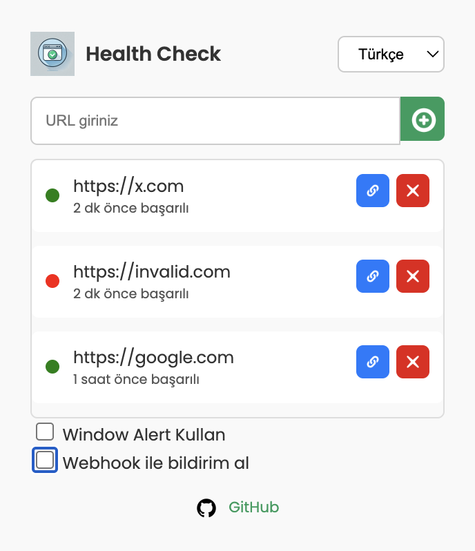
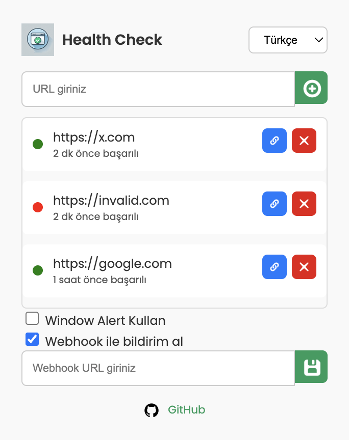

# 🌐 Chrome Health Check Extension

A lightweight and minimalist **Health Check Monitoring** tool designed as a Chrome extension. This project allows you to monitor the availability of multiple URLs in real-time and get notified when a URL becomes unreachable.

The extension is simple yet powerful, operating entirely within the Chrome browser without any backend services (for now 😉). It works as long as Chrome is running, ensuring that your critical services are always being monitored.

---

## 🎯 Features

- 🔄 **Real-time Monitoring:** Automatically checks the status of your URLs at a user-defined interval.
- 📊 **Progress Bar Visualization:** Displays the time remaining for the next health check cycle.
- 🔄 **Manual Refresh:** Instantly checks all URLs with the click of a button.
- ✅ **Status Indicators:** Displays green or red dots to indicate the health of each URL.
- 🔔 **Alerts:** Provides visual and optional window alerts when a URL is down.
- 🔗 **Quick Access:** Visit the monitored URL directly using the "Link" button.
- 🖋️ **Webhook Support:** Notify external services about health check failures via a webhook URL.
- 🌍 **Multilingual Support:** Switch between **English** and **Turkish**.
- 🖥️ **Open Source:** Collaborate, contribute, and improve this project.

---

## 🚀 Installation

1. Click the green Code button and select Download ZIP.
   Extract the downloaded ZIP file to a folder on your computer.
2. Or Clone the repository or download it as a ZIP file:
   ```bash
   git clone https://github.com/aykutarici/health-check-extension.git
   cd chrome-health-check
   ```
3. Open Chrome and go to `chrome://extensions/`.
4. Enable **Developer mode** (toggle in the top-right corner).
5. Click on **Load unpacked** and select the project folder.
6. The extension will appear in your Chrome extensions list. Pin it to your toolbar for easy access.

---

## 🛠️ Usage

1. Open the extension by clicking on its icon in the Chrome toolbar.
2. Enter the URLs you want to monitor in the input field and click **Add** (or press Enter).
3. Optional: Enable **Webhook notifications** and provide a webhook URL for external alerts.
4. Set the **monitoring interval** using the input field (default is 60 seconds). Adjust the value to suit your needs (minimum: 10 seconds, maximum: 300 seconds).
5. Use the **progress bar** to visualize the countdown for the next health check cycle.
6. Use the **refresh button** (green icon) to trigger an immediate health check for all URLs, resetting the progress bar.
7. Monitor the status of each URL:
   - 🟢 Green dot: The URL is healthy (HTTP 200 response).
   - 🔴 Red dot: The URL is unreachable or returned an error.
8. If a URL becomes unreachable:
   - A **popup alert** (optional) will appear.
   - A **webhook notification** (if configured) will be sent with the failed URL and error details.
   - The status will update in real-time.

---

## 📚 Project Goals

This extension aims to provide a simple, lightweight health check tool directly in Chrome without relying on any backend services. It's perfect for:

- Developers needing quick insights into service availability.
- Testing webhooks for error notification.
- Collaborating with the open-source community to explore new features and ideas.

---

## 📈 Future Roadmap

We're open to ideas! Here are some planned improvements:

- 🧩 Backend support for persistent monitoring (even when Chrome is closed).
- 📧 Email notifications for downtime.
- 📊 Analytics dashboard for monitored URLs.
- 🤖 Integration with popular APIs and alert systems (e.g., Slack, Discord).

Feel free to suggest new features or report bugs by opening an [issue](https://github.com/aykutarici/health-check-extension/issues)!

---

## 🧑‍🤝‍🧑 Contributing

This project thrives on community contributions! Here’s how you can help:

1. **Test the Extension:** Install it and report issues in the [Issues section](https://github.com/aykutarici/health-check-extension/issues).
2. **Feature Requests:** Suggest new features by creating a task or enhancement issue.
3. **Pull Requests:** If you're a developer, fork the repo and submit a pull request.
4. **Spread the Word:** Share the project with your friends and colleagues who might benefit from it.

---

## 🖼️ Screenshots

**Main Interface:**



**Webhook Configuration:**



---

## 🛡️ License

This project is licensed under the MIT License. See the [LICENSE](LICENSE) file for details.

---

## 🌟 Support the Project

If you like this project, consider giving it a star ⭐ on GitHub or sharing it with others. Open-source projects thrive with the support of their community.

---

## 💻 Powered By

- **Frontend:** HTML, CSS, JavaScript.
- **Browser API:** Chrome Extensions API.
- **Icons:** [Flaticon](https://flaticon.com), [GitHub Icons](https://github.com).

---

## 🔗 Links

- 🌐 [Ininia Technologies](https://ininia.com)
- 💻 [GitHub Repository](https://github.com/aykutarici/health-check-extension)
- 🐛 [Report Issues](https://github.com/aykutarici/health-check-extension/issues)
